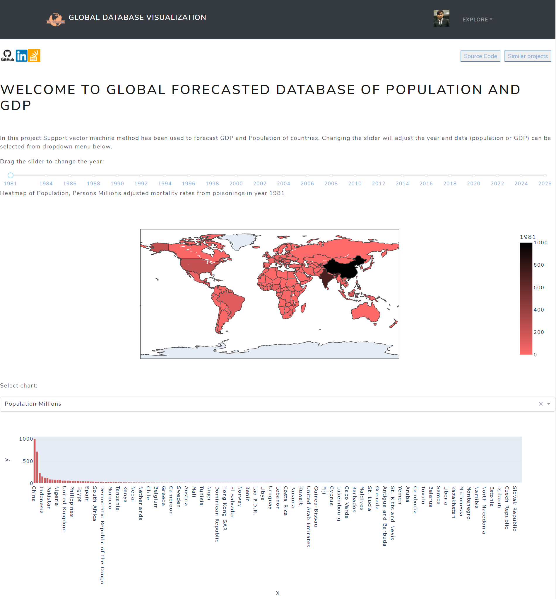
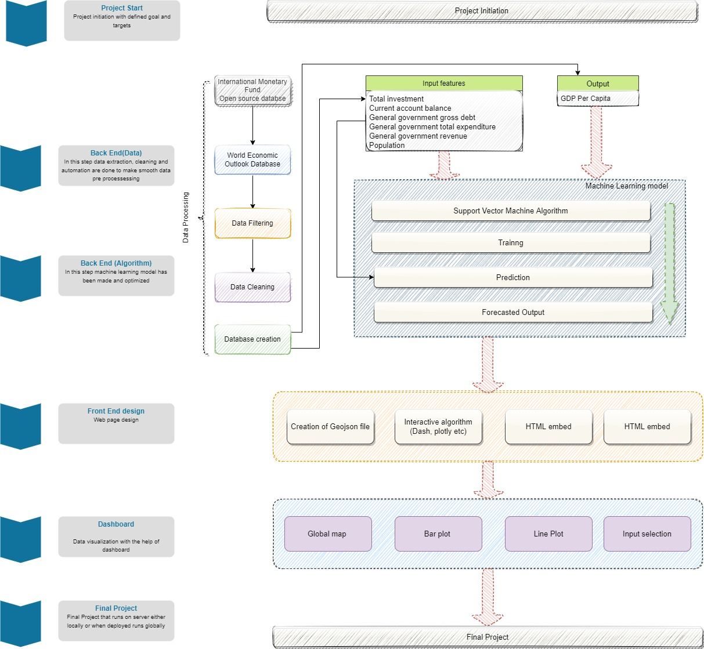

[](https://youtu.be/nTXULyWDL78)
# Support vector machine algorithm for global database
## For deployed Project follow [Go to website](https://svmalgorithm.herokuapp.com/)
This project is for visualization of forecasted data produced by optimized machine learning algorithm.
Description of this project can be understood by flow chart below:




## Authors

- [@hamzahshabbir](https://www.linkedin.com/in/hamzah-shabbir-108765a5/)

  
## Acknowledgements

 - [International Monetary Fund](https://www.imf.org/en/Publications/WEO/weo-database/2021/April)
 - [Dash plotly](https://plotly.com/dash/)
 - [Heroku](https://www.heroku.com/)

  


  
## Feedback

If you have any feedback, please reach out to me at hamzahshabbir7@gmail.com

  
## 🔗 Links
[](https://www.linkedin.com/in/hamzah-shabbir-108765a5/)

  

  
## Running the application locally


First create a virtual environment with conda or venv inside a temp folder, then activate it.


```bash
virtualenv 
Machine-learning-forecasting-using-SVM-venv

# Windows
Machine-learning-forecasting-using-SVM-venv\Scripts\activate
# Or Linux
Machine-learning-forecasting-using-SVM-venv/bin/activate

```
Clone the git repo, then install the requirements with pip
```bash
git clone https://github.com/hamzahshabbir96/Machine-learning-forecasting-using-SVM.git
pip install -r requirements.txt
```
Run the app and follow local host 
```bash
python index.py
```

